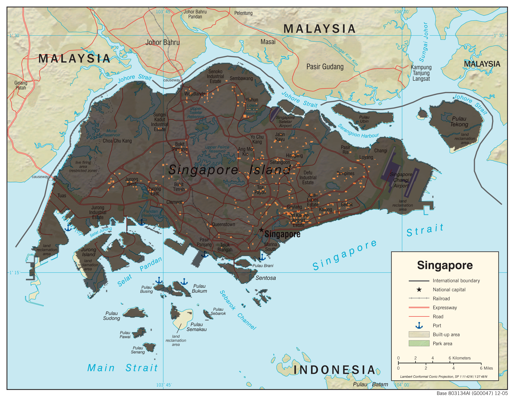

# Singapore_Dengue
### Predicting Dengue Fever outbreaks in Singapore
#### Machine Learning Project for the Center of Urban Science and Progress at New York University
##### Contributors:
##### - Yuan Lai (https://github.com/ylurban)
##### - Diego Garzòn (https://github.com/Diegosmiles)
##### - Bilguun Turboli (https://github.com/bilguun)
##### - Lucas Chizzali (https://github.com/chizzinho)

- Visualization of predicted areas prone to dengue fever, by ylurban
